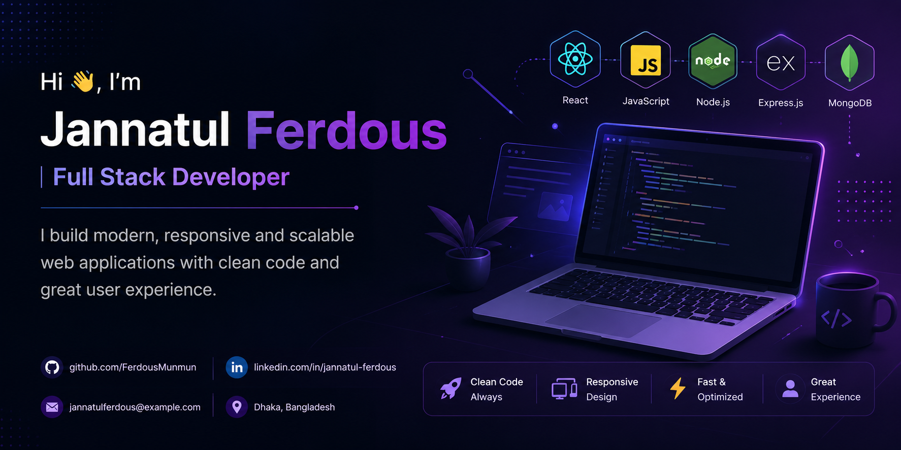

<!-- Hero Banner -->

  

---

## 👨‍💻 About Me

I'm a passionate **Full Stack Web Developer** from **Dhaka, Bangladesh**.
I enjoy building clean, responsive, and scalable web applications while continuously learning new technologies.

  
  
  
  

---

## 🛠️ Skills

  
  &nbsp;
  
  &nbsp;
  
  &nbsp;
  
  &nbsp;
  
  &nbsp;
  
  &nbsp;
  
  &nbsp;
  
  &nbsp;
  
  &nbsp;
  
  &nbsp;
  
  &nbsp;
  

## 🌱 Currently Working On
- Building small web apps to strengthen **frontend & JavaScript skills**
- Learning **advanced React & Node.js**
- Collaborating on **frontend projects** using React or Tailwind CSS
- Exploring **UI/UX best practices**

---
## 📊 GitHub Vaunt Stats

  <!-- Vaunt Level Card -->
  

  <!-- Streak & Contributions -->
  

  <!-- Contribution Graph -->
  

---

---

## 📫 Contact Me
- Email: [ferdousmunmun75@gmail.com](mailto:ferdousmunmun75@gmail.com)
- LinkedIn:https://www.linkedin.com/in/jannatul-ferdous-web/
- GitHub: https://github.com/FerdousMunmun
💡 **Fun fact:** I like to think I’m funny 😄, explore new tech, and contribute to meaningful projects!

